# Project Pratikum
Repository ini dibuat untuk memenuhi tugas Pertemuan 6 - Bahasa Pemrograman.

Nama    : Maulana Muhamad

NIM     : 312010188

Kelas   : TI.20. A.1

## Pertemuan 6 - lab 1
Pada lab 1 pertemuan ke 6, Saya di beri tugas oleh Dosen  mempelajari Operator Aritmatika menggunakan bahasa pemograman python.  

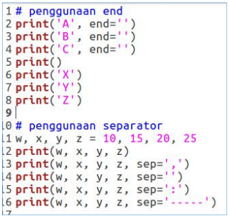

> Penggunaan end digunakan untuk menambahkan kata yang dicetak di akhir baris. 

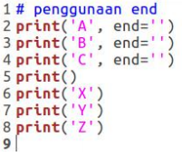

 > Penggunaan print() digunakan untuk mencetak output, seperti syntax dibawah ini : 

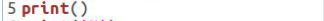

 > Syntax dibawah ini digunakan untuk menampilkan output berupa string 

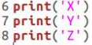

 > Hasil dari source code terseut seperti gambar di bawah ini:

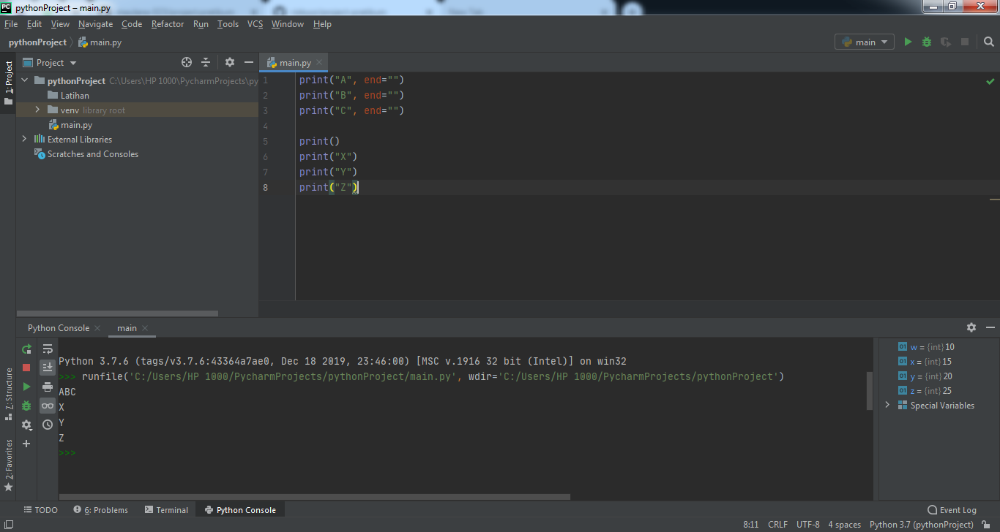

* Pengertian separaktor Sepaktor adalah pemisah yang berfungsi sebagai tanda pemisah antar objek yang dicetak. Defaultnya adalah tanda spasi.

> Pendeklarasian beberapa variable berserta nilainya.

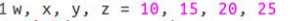

> Menampilkan hasil setiap variable tiap-tiap variable. 

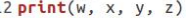

> Menampilkan hasil variable dari tiap-tiap variable menggunakan pemisah , (koma). 

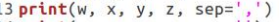

> Menampilkan hasil variable dari tiap-tiap variable tanpa menggunakan pemisah. 

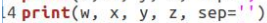

> Menampilkan hasil variable dari tiap-tiap variable dengan menggunakan pemisah : (titik dua). 

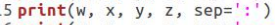

>Menampilkan hasil variable dari tiap-tiap variable dengan menggunakan pemisah ----. 

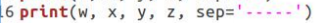

>Hasil dari syntax / source code diatas adalah seperti berikut ini: 

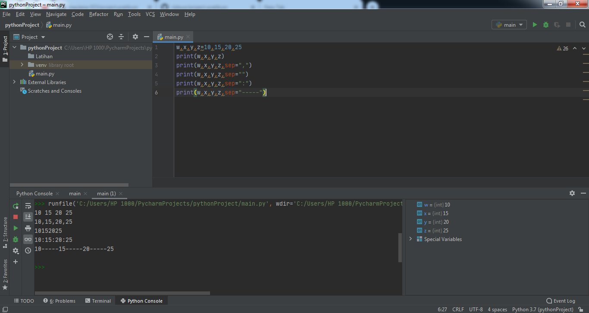

## Pertemuan 6 - Lab 1.5

1. String format
String formatting atau pemformatan string memungkinkan kita menyuntikkan item kedalam string daripada kita mencoba menggabungkan string menggunakan koma atau string concatenation. 

> Penggunaan pada source yang di berikan Dosen sebagai berikut :

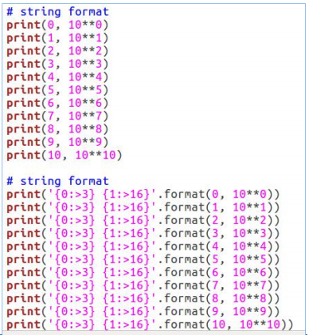

> Tugas yang di berikan oleh Dosen adalah seperti gambar dibawah ini: 

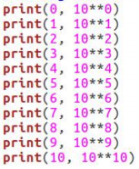

Pada syntax / source code string format 1 akan menampilkan output berupa 2 outputan.
Yang pertama (sebelah kiri) akan menampilkan angka urut dari angka 0 hingga 10, sedangkan sebelah kanan akan menampilkan Oprasi Aritmatika Pangkat.

> Dengan ketentuan sebagau berikut, oprasi pangkat dengan angka kiri sebagai pokok (Rumus : ** [Bintang dua])
Hasil dari syntax tersebut adalah 10 pangkat 0, hingga 10 pangkat 10. Dengan output sebagai berikut :

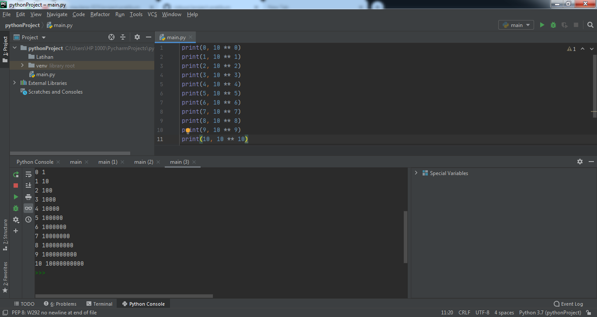

2. String Format 2
   Pada syntax / source code string format 2 akan menampilkan output berupa 2 output'an juga (Seoerti string format 1, yaitu kanan dan kiri)
    Dengan ketentuan sebagai berikut :

> Alignment, padding, dan precesion dengan .format() dalam kurung kurawal kita dapat menetapkan panjang bidang, rata kanan/kiri, parameter pembulatan dan banyak lagi.

>Secara default, .format() menggunakan rata text kiri, angka ke kanan. <,^, atau > untuk perataan kiri, tengah , atau kanan.

Hasil string format 2 adalah :

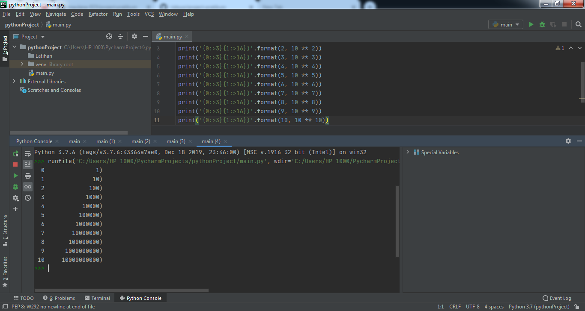

## Pertemuan 6 - Lab 2

* Konversi Nilai Variable Untuk pembahasan terakhir. 
Kali ini akan menyelesaikan tugas Lab 2 dari Dosen, yaitu Konversi Nilai Variable. Seperti gambar dibawah ini:

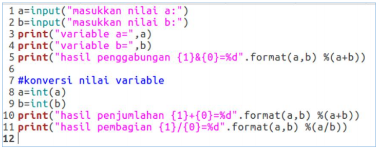

Sekian hanya ini yang dapat saya sampaikan, semoga bermanfaat.

#TERIMAKASIH